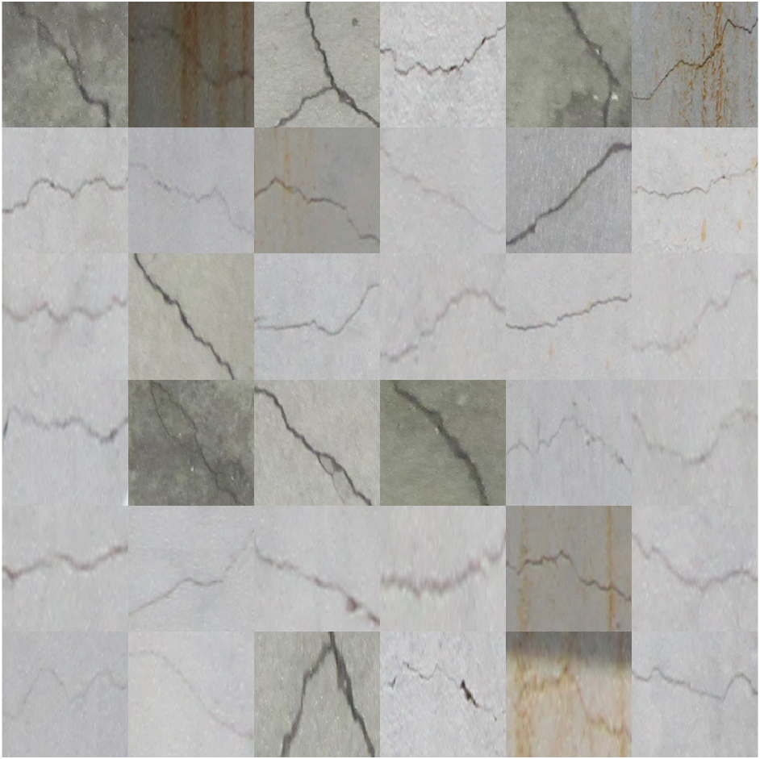
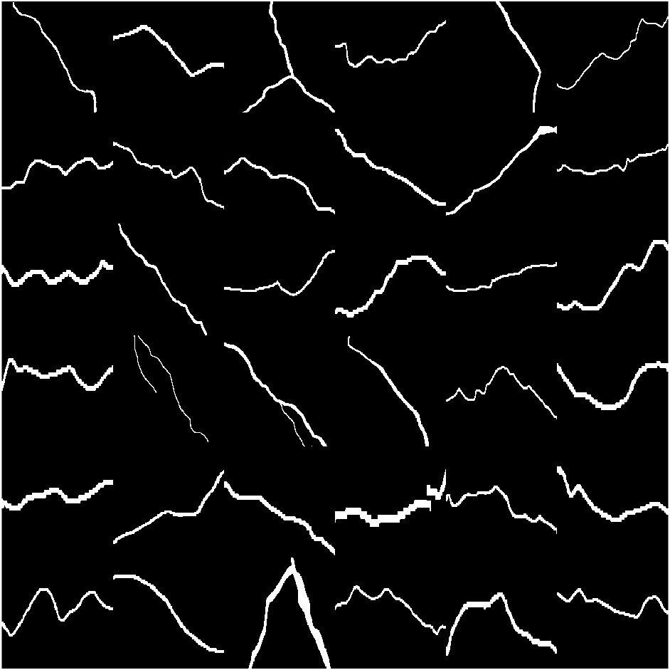

# Cracks semantic segmentation datasets
Cracks are the defects formed by cyclic loading, fatigue, shrinkage, creep, and so on. In addition, they represent the deterioration of the structures over some time. Therefore, it is essential to detect and classify them according to the condition grade at the early stages to prevent the collapse of structures. Deep learning and machine learning-based supervised semantic segmentation methods requires carefully annotated images of cracks. This is a repository of human annotated semantic segmentation datasets of concrete, pavement, walls/mixed and masonry/bricks cracks surface. I collected these datasets during my Ph.D. days and used many for my dissertation.

## Datasets examples
| No. | Dataset name | Cracks images | Ground-truth images | Remarks | Download link |
| ------------- |  |  |  ------------- | ------------- | ------------- |
| 1 | Cracks-200 |  |  | Conrete surfaces, easy and a low-resolution dataset. I call it Cracks-101 dataset  | [Cracks-200](https://1drv.ms/f/c/49b23bc11eecd6a8/EhR2i1qbyhlKn6JmjTVdWQ4BVUcKofT80zNf12E0tDVgCw?e=DYmZzs) |
| 2 | Cracks-1K (644 x 483) | _crack.png) | _gt.png) | Conrete and pavement surfaces, quite challenging dataset. | [Cracks-1K (644 x 483)](https://1drv.ms/f/c/49b23bc11eecd6a8/ErmWulPITuVDmxcHQZK5bAkBr-FGHSYFI1QWHnjY_YikQA?e=rJUW4W) |
| 3 | To be uploaded soon |  |  |  |
| 4 | Cracks-4K (512 x 512) | _crack.png) | _gt.png) | Conrete surfaces dataset. It has a medium and large-sized cracks. Overall, clean and high resolution dataset. | [Cracks-4K (512 x 512)](https://1drv.ms/f/c/49b23bc11eecd6a8/Evcsn2XWDblLv76EDFOwf0cB_V4WbqpRkOoH8YAIh5JfGg?e=fajgSS) |
| 5 | Cracks-1K (1280 x 720) | _crack.png) | _gt.png) | Conrete surfaces dataset. It has some thin, medium and large-sized cracks. Overall, clean and high resolution dataset. | [Cracks-1K (1280 x 720)](https://1drv.ms/f/c/49b23bc11eecd6a8/Eias7mEICpdOju5slI7_mpwBT-T73E8mAmu6N_vVYXQG8Q?e=dXBKIm) |
| 6 | Cracks-1K (448 x 252) | _crack.png) | _gt.png) | Conrete surfaces dataset. It has some thin, medium and large-sized cracks. Same as Cracks-1K (1280 x 720), but with a different resolution managable for Deep Learning and Machine Learning methods. Overall, clean and high resolution dataset. | [Cracks-1K (448 x 252)](https://1drv.ms/f/c/49b23bc11eecd6a8/EgXYLiqrSNdKtzWPbJp3mQQBZN-xlivQHVCfzq8jxA-jkQ?e=8xqBD2) |
| 7 |  |  |  |  |  |
| 8 | Masonry-Brick Cracks 81 (5152x3864) | _crack.png) | _gt.png) | Masonry, bricks, bricks cladding and their concrete joints surfaces dataset. It has some thin, medium and large-sized cracks. Overall, clean and very high resolution dataset. I recommend to use the [Cracks cropper algorithm](https://github.com/preethamam/CracksSplitterCropper-Dataset) to split these large resolution images to make it more manable for the Deep Learning and Machine Learning methods. Also, this cracks cropper algorithm can be used to set the overlapping between to crack crop images. | [Masonry-Brick Cracks 81 (5152x3864)](https://1drv.ms/f/c/49b23bc11eecd6a8/Ek_azWXTJltNrWi4vqGy-XMBuNUFhzqxON5c1U3qXBTwNA?e=CYdtxs) |

# Citation
All cracks semantic segmentation datasets are available to the public. If you use any of these datasets in your research, please use the following BibTeX entry to cite:
```bibtex
@PhdThesis{preetham2021vision,
author = {{Aghalaya Manjunatha}, Preetham},
title = {Vision-Based and Data-Driven Analytical and Experimental Studies into Condition Assessment and Change Detection of Evolving Civil, Mechanical and Aerospace Infrastructures},
school =  {University of Southern California},
year = 2021,
type = {Dissertations & Theses},
address = {3550 Trousdale Parkway Los Angeles, CA 90089},
month = {December},
note = {Condition assessment, Crack localization, Crack change detection, Synthetic crack generation, Sewer pipe condition assessment, Mechanical systems defect detection and quantification}
}
```

# Acknowledgements
I thank Shravan Ravi, Vinay Hegde, and Milind Bhat (chronological order) for their efforts in the collection and preparation of the crack and non-crack image database around the University of Southern California (USC) campus at Los Angeles, USA. In addition, I thank Ryan, Youngseok and Wisepl Private Limited Data (chronological order) for their conscientious efforts in creating for crack semantic segmentation annotations.

# Feedback
Please rate and provide feedback for the further improvements.

